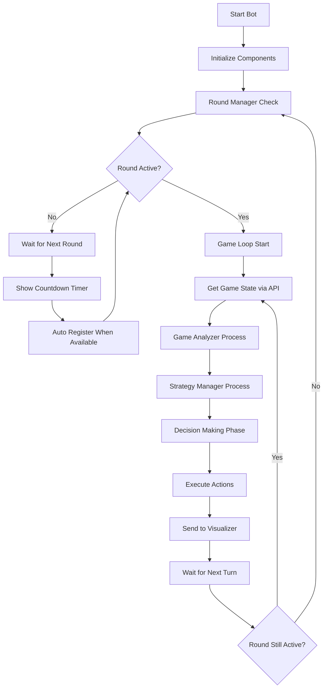
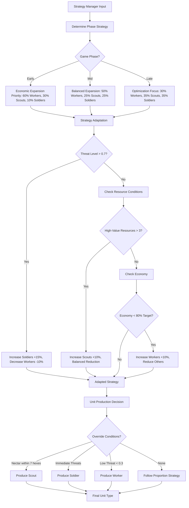
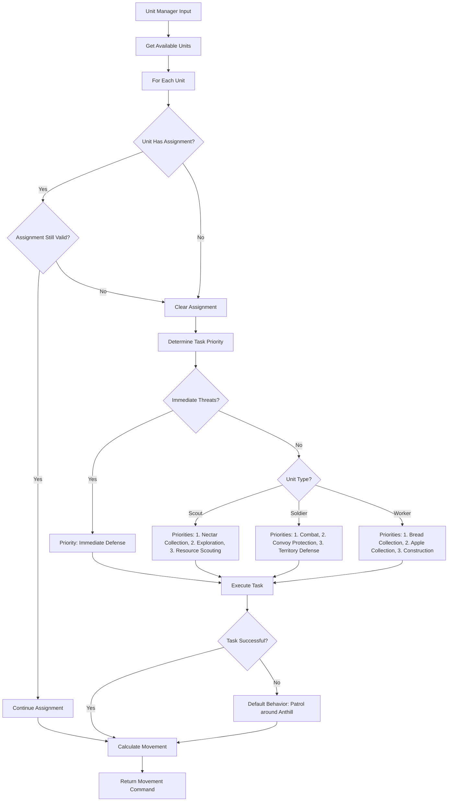
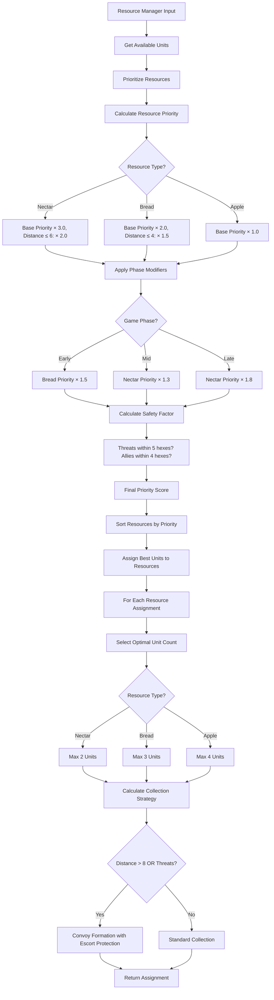
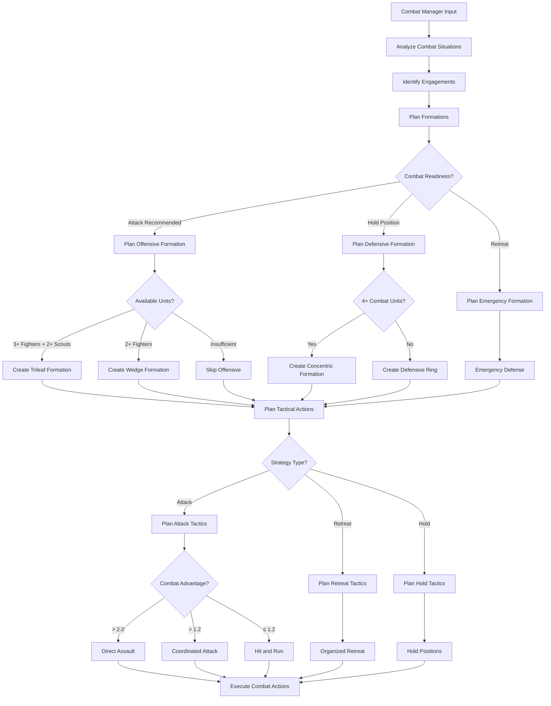
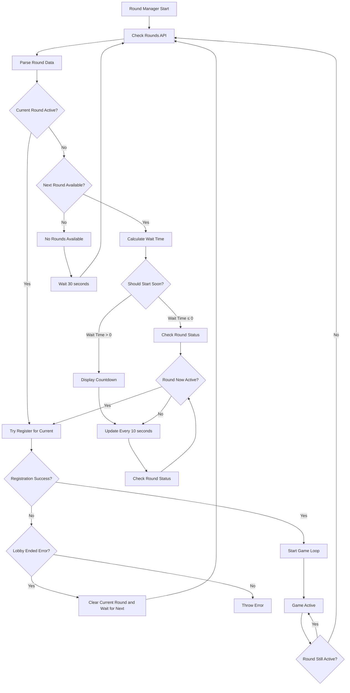
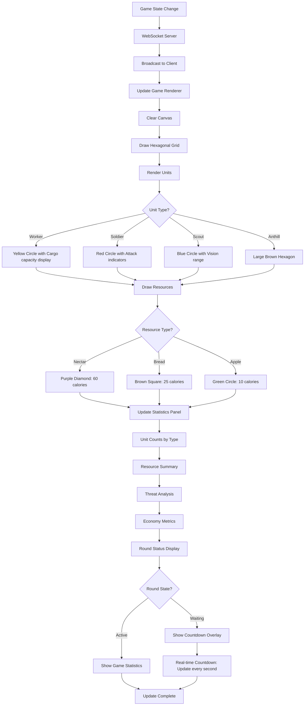
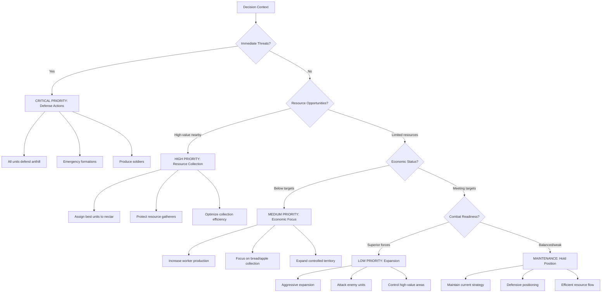

# Game Logic and Decision-Making Algorithms

This document contains Mermaid diagrams visualizing the core game logic and decision-making algorithms of the AI strategy bot.

## Main Game Loop Flow

## Game Analysis System

```mermaid
flowchart TD
    A[Game State Input] --> B[GameAnalyzer Main Process]
    
    B --> C[Determine Game Phase]
    C --> C1[Early: turns 1-20]
    C --> C2[Mid: turns 21-50] 
    C --> C3[Late: turns 51+]
    
    B --> D[Analyze Units]
    D --> D1[Count My Units by Type]
    D --> D2[Calculate Unit Proportions]
    D --> D3[Identify Enemy Units]
    D --> D4[Locate Anthill Position]
    
    B --> E[Analyze Resources]
    E --> E1[Categorize by Type: Nectar/Bread/Apple]
    E --> E2[Calculate Distances]
    E --> E3[Prioritize by Value/Distance]
    E --> E4[Identify High-Value Resources]
    
    B --> F[Analyze Threats]
    F --> F1[Identify Immediate Threats: Distance ≤ 3 from Anthill]
    F --> F2[Calculate Nearby Threats: Distance ≤ 8 from Anthill]
    F --> F3[Assess Overall Threat Level]
    F --> F4[Calculate Unit Combat Strength]
    
    B --> G[Analyze Territory]
    G --> G1[Calculate Controlled Area]
    G --> G2[Identify Expansion Opportunities]
    G --> G3[Assess Strategic Positions]
    
    B --> H[Analyze Economy]
    H --> H1[Calculate Calories per Turn]
    H --> H2[Track Total Calories]
    H --> H3[Compare with Phase Targets]
    H --> H4[Assess Economic Efficiency]
    
    C1 --> I[Combined Analysis Result]
    C2 --> I
    C3 --> I
    D4 --> I
    E4 --> I
    F4 --> I
    G3 --> I
    H4 --> I
```

## Strategy Decision Tree

## Unit Management Decision Flow

## Resource Management Flow

## Combat Management System

## Round Management Lifecycle

## Visualizer Real-time Updates

## Decision Priority Matrix

## Algorithm Complexity and Performance

The decision-making system operates with the following characteristics:

- **Game State Analysis**: O(n) where n is the number of units + resources
- **Strategy Calculation**: O(1) constant time for phase-based decisions  
- **Unit Assignment**: O(n×m) where n is units and m is available tasks
- **Pathfinding**: O(k) where k is the direct path length (simplified approach)
- **Combat Analysis**: O(n²) for threat assessment between all unit pairs
- **Resource Prioritization**: O(r log r) where r is the number of resources

The system is designed to handle real-time decision making with typical game states of 50-100 units and 20-50 resources efficiently.