# Game Logic and Decision-Making Algorithms

This document contains Mermaid diagrams visualizing the core game logic and decision-making algorithms of the AI strategy bot.

## Main Game Loop Flow


## Advanced Game Analysis System

```mermaid
flowchart TD
    A[Game State Input] --> B[GameAnalyzer Main Process]
    
    B --> C[Determine Game Phase]
    C --> C1[Early: turns 1-20]
    C --> C2[Mid: turns 21-50] 
    C --> C3[Late: turns 51+]
    
    B --> D[Analyze Units]
    D --> D1[Count My Units by Type]
    D --> D2[Calculate Unit Proportions]
    D --> D3[Identify Enemy Units]
    D --> D4[Locate Anthill Position]
    
    B --> E[Analyze Resources]
    E --> E1[Categorize by Type: Nectar/Bread/Apple]
    E --> E2[Calculate Distances]
    E --> E3[Prioritize by Value/Distance]
    E --> E4[Identify High-Value Resources]
    E --> E5[FILTER: Exclude Anthill Resources]
    
    B --> F[Analyze Threats]
    F --> F1[Identify Immediate Threats: Distance ≤ 3 from Anthill]
    F --> F2[Calculate Nearby Threats: Distance ≤ 8 from Anthill]
    F --> F3[Assess Overall Threat Level]
    F --> F4[Calculate Unit Combat Strength]
    
    B --> G[Analyze Territory]
    G --> G1[Calculate Controlled Area]
    G --> G2[Identify Expansion Opportunities]
    G --> G3[Assess Strategic Positions]
    
    B --> H[Analyze Economy]
    H --> H1[Calculate Calories per Turn]
    H --> H2[Track Total Calories]
    H --> H3[Compare with Phase Targets]
    H --> H4[Assess Economic Efficiency]
    
    B --> TM[Update Threat Map]
    TM --> TM1[Track Enemy Sightings]
    TM --> TM2[Generate Interest Areas]
    TM --> TM3[Decay Old Threats]
    TM --> TM4[Recommend Scout Targets]
    
    B --> TR[Analyze Traversability]
    TR --> TR1[Categorize Hex Movement Costs: Easy ≤1, Moderate ≤3, Difficult ≤5, Avoid >5]
    TR --> TR2[Generate Exploration Targets with Cost Priority]
    TR --> TR3[Identify Avoidance Zones for High-Cost Areas]
    TR --> TR4[Calculate Optimal Paths for Scouts and Combat Units]
    TR --> TR5[Recommend Low-Cost Areas for Patrol Positioning]
    
    B --> EC[Analyze Enemy Composition]
    EC --> EC1[Count Enemy Workers/Soldiers/Scouts]
    EC --> EC2[Calculate Unit Ratios and Total Strength]
    EC --> EC3[Classify Strategy: Economic/Military/Scout/Balanced]
    EC --> EC4[Assess Threat Level: Minimal to Critical]
    EC --> EC5[Generate Recommended Counter-Response]
    
    C1 --> I[Combined Analysis Result]
    C2 --> I
    C3 --> I
    D4 --> I
    E5 --> I
    F4 --> I
    G3 --> I
    H4 --> I
    TM4 --> I
    TR5 --> I
    EC5 --> I
```



## Advanced Strategy Decision Tree with Enemy Composition Analysis


## Strategy Decision Tree


## Intelligent Unit Management Decision Flow

```mermaid
flowchart TD
    A[Unit Manager Input] --> B[Get Available Units]
    B --> C[For Each Unit]
    
    C --> D{Central Assignment?}
    D -->|Yes| E[Execute Resource Assignment]
    D -->|No| F{Can Collect Resources?}
    
    F -->|Yes| G[Wait for Central Assignment]
    F -->|No| H[LEVEL 1: Critical Priorities]
    
    E --> I[Calculate Movement]
    G --> I
    H --> J{Should Return to Anthill?}
    I --> MM[Return Movement Command]
    J -->|Cargo ≥80% OR has nectar| K[CRITICAL: Return to Anthill]
    J -->|No| L{End Game Restriction?}
    
    L -->|Turn ≥380| M[Calculate Safe Distance]
    M --> N{Safe Movement Only?}
    N -->|Yes| O[Get Nearby Resource Tasks]
    N -->|No| P[LEVEL 2: Absolute Priorities]
    
    L -->|Turn <380| P
    O --> Q{Found Safe Tasks?}
    Q -->|Yes| R[Execute Safe Tasks]
    Q -->|No| K
    
    P --> S{Nectar Available?}
    S -->|Yes + Compatible| T[ABSOLUTE: Nectar Collection]
    S -->|No| U[LEVEL 3: Cargo Management]
    
    U --> V{Cargo ≥50%?}
    V -->|Yes| W[Should Avoid Distractions]
    V -->|No| X[LEVEL 4: Aggressive Actions]
    
    W --> Y[Get Safe Resource Tasks]
    Y --> Z{Safe Tasks Found?}
    Z -->|Yes| AA[Execute Safe Tasks]
    Z -->|No| K
    
    X --> BB{Enemy Anthills Known?}
    BB -->|Yes| CC[Analyze Raid Feasibility]
    BB -->|No| DD{Immediate Threats?}
    
    CC --> EE{Raid Feasible?}
    EE -->|Yes| FF[PRIORITY: Raid Enemy Anthill]
    EE -->|No| DD
    
    DD -->|Yes| GG[PRIORITY: Immediate Defense]
    DD -->|No| HH[LEVEL 5: Unit Specialization]
    
    HH --> II{Unit Type?}
    II -->|Scout| JJ[1. Find Enemy Anthill<br/>2. Aggressive Exploration]
    II -->|Soldier| KK[1. Hunt Enemies<br/>2. Combat<br/>3. Territory Defense]
    II -->|Worker| LL[1. Assist Raid<br/>2. Construction]
    
    K --> I
    R --> I
    T --> I
    AA --> I
    FF --> I
    GG --> I
    JJ --> I
    KK --> I
    LL --> I
```



## Centralized Resource Assignment System (MANDATORY)


## Resource Management Flow with Reservation System

```mermaid
flowchart TD
    A[Resource Manager Input] --> B[Get Available Units without assignments]
    B --> C[Get Unreserved Resources]
    
    C --> D[Calculate Resource Priority]
    D --> E{Resource Type?}
    E -->|Nectar| F[Base Priority × 5.0, Distance ≤ 6: × 3.0]
    E -->|Bread| G[Base Priority × 2.5, Distance ≤ 4: × 1.8] 
    E -->|Apple| H[Base Priority × 1.0]
    
    F --> I[Apply Phase Modifiers]
    G --> I
    H --> I
    
    I --> J{Game Phase?}
    J -->|Early| K[Bread Priority × 1.5, Nectar × 1.5]
    J -->|Mid| L[Nectar Priority × 2.0]
    J -->|Late| M[Nectar Priority × 2.5]
    
    K --> N[Calculate Safety Factor]
    L --> N
    M --> N
    
    N --> O[Threats within 5 hexes? Allies within 4 hexes?]
    O --> P[Final Priority Score]
    
    P --> Q[Sort Resources by Priority]
    Q --> R[For Each Resource: Find Best Unit]
    
    R --> S[Calculate Unit-Resource Score]
    S --> T{Unit Cargo Compatible?}
    T -->|Same Type| U[Priority × 1.5 bonus]
    T -->|Different Type| V[Priority × 0.3 penalty]
    T -->|Empty| W[Normal Priority]
    
    U --> X[Attempt Resource Reservation]
    V --> X
    W --> X
    
    X --> Y{Reservation Success?}
    Y -->|Yes| Z[Create Gather Action]
    Y -->|No| AA[Try Next Resource]
    
    Z --> BB[Log Assignment Success]
    AA --> CC[Log Reservation Conflict]
    
    BB --> DD[Return Actions]
    CC --> DD
```



## Cargo Management and Resource Logistics

```mermaid
flowchart TD
    A[Unit with Resources] --> B[Check Cargo Status]
    
    B --> C{Resource Type?}
    C -->|Nectar| D[IMMEDIATE: Return to Anthill]
    C -->|Bread/Apple| E[Check Cargo Percentage]
    
    E --> F{Cargo ≥ 80%?}
    F -->|Yes| G[CRITICAL: Return to Anthill]
    F -->|No| H{Cargo ≥ 50%?}
    
    H -->|Yes| I[Avoid Distractions Mode]
    H -->|No| J[Normal Operations]
    
    I --> K[Search Safe Resources]
    K --> L{Safe Resources Found?}
    L -->|Yes| M[Check Compatibility]
    L -->|No| N[Head to Anthill]
    
    M --> O{Same Resource Type?}
    O -->|Yes| P[Collect if Safe Distance ≤8 & No Threats]
    O -->|No| Q[Cannot Mix: Head to Anthill]
    
    J --> R[Continue Normal Tasks]
    
    D --> S[📦 Log: Heading to anthill with nectar]
    G --> T[📦 Log: Heading to anthill, cargo full]
    N --> U[📦 Log: No safe resources, returning]
    Q --> V[📦 Log: Cannot mix resources, returning]
    P --> W[Continue Collection]
    
    S --> X[At Anthill?]
    T --> X
    U --> X
    V --> X
    
    X -->|Yes| Y[🏠 Log: Unloaded resources at anthill]
    X -->|No| Z[Continue Movement]
    
    Y --> AA[Clear Cargo, Resume Tasks]
    Z --> BB[Next Turn]
```



## Advanced Combat Management System with Intelligent Threat Assessment

```mermaid
flowchart TD
    A[Combat Manager Input] --> B[Analyze Combat Situations]
    B --> C[Multi-Factor Threat Assessment]
    
    C --> C1[Factor 1: Calculate Unit DPS]
    C --> C2[Factor 2: Detect Active Attacks]
    C --> C3[Factor 3: Economic Threat Analysis]
    C --> C4[Factor 4: Distance to Base]
    C --> C5[Factor 5: Health Factor Analysis]
    C --> C6[Factor 6: Unit Type Base Threat]
    
    C1 --> D[Priority Target Selection]
    C2 --> D
    C3 --> D
    C4 --> D
    C5 --> D
    C6 --> D
    
    D --> E[selectPriorityTarget with 6-Factor Scoring]
    E --> F[Calculate Combined Threat Score]
    F --> G[Score = DPS×2 + EconomicThreat×4 + AttackBonus + DistanceScore + HealthFactor + TypeThreat]
    
    G --> H[Combat Action Planning]
    H --> H1{Anthill Threats ≤8 hexes?}
    H1 -->|Yes| I[PRIORITY 1: Defend Anthill]
    H1 -->|No| J[Check Wounded Soldiers]
    
    I --> I1[Sort Threats by Distance]
    I1 --> I2[Focus Fire on Closest Threat]
    I2 --> I3[All Soldiers Attack Same Target]
    
    J --> J1{Soldiers Health <30%?}
    J1 -->|Yes| K[PRIORITY 2: Retreat Wounded]
    J1 -->|No| L[Attack with Healthy Soldiers]
    
    K --> K1[Calculate Path to Anthill]
    K1 --> K2[Execute Retreat Movement]
    
    L --> L1[Find Nearby Enemies ≤20 hexes]
    L1 --> L2[Apply Advanced Target Selection]
    L2 --> L3[FOCUS FIRE: All Target Same Enemy]
    L3 --> L4[Coordinate Attack Movements]
    
    L4 --> M[Patrol for Unassigned Soldiers]
    M --> M1[Strategic Patrol Planning]
    
    M1 --> M2{Enemy Bases Known?}
    M2 -->|Yes| N[Strategic Intercept Patrol]
    M2 -->|No| O{Turn <150?}
    
    N --> N1[Position Between Bases]
    N1 --> N2[Use Traversability Optimization]
    N2 --> N3[Calculate Optimal Intercept Point]
    
    O -->|Yes| P[Aggressive Reconnaissance]
    O -->|No| Q[Defensive/Bottleneck Patrol]
    
    P --> P1[Expand Search Radius Over Time]
    P1 --> P2[Priority Direction Selection]
    P2 --> P3[High-Priority Areas: East/West]
    
    Q --> Q1[Find Strategic Bottlenecks]
    Q1 --> Q2[Resource Cluster Defense]
    Q2 --> Q3[Adaptive Enemy Response]
    
    I3 --> R[Generate Combat Movements]
    K2 --> R
    L4 --> R
    N3 --> R
    P3 --> R
    Q3 --> R
    
    R --> S[Path Finding with A* Algorithm]
    S --> T[Validate Combat Assignments]
    T --> U[Log Combat Decisions with Details]
    U --> V[Return unit_id-specific Combat Actions]
```



## Round Management Lifecycle


## Visualizer Real-time Updates


## End-Game Strategy and Safety Calculations

```mermaid
flowchart TD
    A[Check Current Turn] --> B{Turn ≥ 380?}
    B -->|No| C[Normal Operations]
    B -->|Yes| D[End-Game Mode Activated]
    
    D --> E[Calculate Remaining Turns: 420 - currentTurn]
    E --> F[For Each Unit: Calculate Safe Distance]
    
    F --> G[Get Unit Speed by Type]
    G --> H{Unit Type?}
    H -->|Worker| I[Speed = 3]
    H -->|Soldier| J[Speed = 4] 
    H -->|Scout| K[Speed = 7]
    
    I --> L[Calculate: maxSafeDistance = (turnsLeft × 3) ÷ 2 - 2]
    J --> M[Calculate: maxSafeDistance = (turnsLeft × 4) ÷ 2 - 2]
    K --> N[Calculate: maxSafeDistance = (turnsLeft × 7) ÷ 2 - 2]
    
    L --> O[Check Current Distance to Anthill]
    M --> O
    N --> O
    
    O --> P{Distance > maxSafeDistance?}
    P -->|Yes| Q[RESTRICT: Must return to anthill area]
    P -->|No| R[Allow limited nearby resource collection]
    
    R --> S[Find Resources within maxSafeDistance]
    S --> T{Nearby Resources Found?}
    T -->|Yes| U[Allow Collection of Safe Resources]
    T -->|No| V[Return to Anthill Area]
    
    Q --> W[Force Return to Anthill]
    U --> X[Continue with Restricted Movement]
    V --> X
    W --> X
    
    X --> Y[Log End-Game Decision]
    Y --> Z[🏁 End-Game restrictions active: Turn currentTurn/420]
    
    C --> AA[Normal Decision Tree]
```

## Intelligent Decision Priority Matrix

```mermaid
flowchart TD
    A[Decision Context] --> B[LEVEL 1: Critical Life & Death]
    B --> B1{Cargo ≥80% OR Nectar?}
    B1 -->|Yes| B2[CRITICAL: Return to Anthill]
    B1 -->|No| B3{Turn ≥380?}
    B3 -->|Yes| B4[CRITICAL: End-Game Restrictions]
    B3 -->|No| C[LEVEL 2: Absolute Resource Priority]
    
    C --> C1{Nectar Available?}
    C1 -->|Yes| C2[ABSOLUTE: Nectar Collection Overrides All]
    C1 -->|No| D[LEVEL 3: Risk Management]
    
    D --> D1{Cargo ≥50%?}
    D1 -->|Yes| D2[Avoid Distractions: Safe Resources Only]
    D1 -->|No| E[LEVEL 4: Strategic Expansion]
    
    E --> E1{Enemy Anthills Known?}
    E1 -->|Yes| E2[Analyze Raid Feasibility]
    E2 --> E3{Raid Score ≥120?}
    E3 -->|Yes| E4[HIGH: Raid Enemy Anthill]
    E3 -->|No| F[LEVEL 5: Defensive Operations]
    E1 -->|No| F
    
    F --> F1{Immediate Threats?}
    F1 -->|Yes| F2[HIGH: Immediate Defense]
    F1 -->|No| G[LEVEL 6: Unit Specialization]
    
    G --> G1{Unit Type?}
    G1 -->|Scout| G2[Find Enemies → Explore → Resources]
    G1 -->|Soldier| G3[Hunt Enemies → Combat → Resources]
    G1 -->|Worker| G4[Bread → Apples → Support]
    
    B2 --> H[Execute with CRITICAL Priority]
    B4 --> H
    C2 --> H
    D2 --> I[Execute with SAFE Priority]
    E4 --> J[Execute with HIGH Priority]
    F2 --> J
    G2 --> K[Execute with NORMAL Priority]
    G3 --> K
    G4 --> K
    
    H --> L[💼 Log Critical Decision]
    I --> M[⚠️ Log Safety Decision]
    J --> N[⚔️ Log Combat Decision]
    K --> O[📋 Log Normal Decision]
```



## Algorithm Complexity and Performance

The enhanced decision-making system operates with the following characteristics:

### Core Systems
- **Game State Analysis**: O(n) where n = units + resources + threats
- **Intelligent Priority System**: O(1) constant time hierarchical checks
- **Cargo Management**: O(1) per unit for cargo status and compatibility
- **End-Game Calculations**: O(n) where n = number of units (distance calculations)
- **Resource Compatibility**: O(1) per resource type check
- **Safe Resource Search**: O(r×t) where r = resources, t = threats (safety validation)
- **Resource Assignment Manager**: O(1) for reservation checks, O(u) for cleanup where u = dead units
- **Centralized Reservations**: O(r) space for resource reservations, O(1) priority comparisons

### Combat Systems  
- **Advanced Threat Assessment**: O(e×u) where e = enemies, u = my units (6-factor analysis)
- **Formation Planning**: O(u) where u = combat units
- **Individual Unit Actions**: O(u×a) where u = units, a = actions per unit
- **Raid Feasibility**: O(1) mathematical scoring per enemy anthill
- **Focus Fire Coordination**: O(e) where e = enemy units (priority target selection)
- **DPS Calculations**: O(1) per enemy unit with health scaling
- **Economic Threat Analysis**: O(e×w) where e = enemies, w = workers

### Optimization Features
- **Pathfinding**: O(k) where k = direct path length (hexagonal grid)
- **Resource Prioritization**: O(r log r) where r = number of resources  
- **Unit Assignment**: O(n×p) where n = units, p = priority levels (max 6)
- **Traversability Analysis**: O(h) where h = total hex count for movement cost mapping
- **Enemy Composition Analysis**: O(e) where e = enemy units for strategy classification
- **Tactical Adaptation Generation**: O(1) per strategy type with preset counter-measures
- **Logging System**: O(1) per decision with structured event categorization

### Real-Time Performance
The enhanced system maintains **sub-150ms decision times** for complex scenarios:
- 50-100 units: ~60-100ms total processing (increased due to advanced analysis)
- 20-50 resources: ~10-20ms resource analysis  
- 10-30 threats: ~25-40ms advanced threat assessment (6-factor analysis)
- Enemy composition analysis: ~5-15ms per turn
- Traversability mapping: ~20-35ms full map analysis (cached after first calculation)
- Tactical adaptations: ~2-8ms per strategy classification
- End-game calculations: ~5-10ms per unit

### Memory Efficiency
- **Cargo tracking**: O(n) space for unit resource states
- **Assignment cache**: O(n) space for unit task assignments
- **Path validation**: O(k) temporary space per pathfinding operation
- **Combat formations**: O(u) space for unit positioning data
- **Traversability map**: O(h) space for hex movement costs (persistent cache)
- **Enemy composition history**: O(t) space where t = turns tracked for strategy analysis
- **Threat assessment cache**: O(e) space for enemy threat scores per turn
- **Tactical adaptations**: O(1) space for current strategy adaptations

The enhanced system prioritizes critical decisions (cargo management, end-game safety) with O(1) complexity while maintaining comprehensive strategic analysis for complex scenarios.

## Enemy Composition Analysis and Adaptive Tactics


## Traversability Mapping and Movement Optimization

```mermaid
flowchart TD
    A[Map Analysis Input] --> B[Analyze Each Hex Movement Cost]
    
    B --> C[Cost Categorization]
    C --> C1[Easy: Cost ≤1 - High Priority]
    C --> C2[Moderate: Cost ≤3 - Medium Priority]
    C --> C3[Difficult: Cost ≤5 - Low Priority]
    C --> C4[Avoid: Cost >5 - Avoidance Zones]
    
    C1 --> D[Generate Optimization Data]
    C2 --> D
    C3 --> D
    C4 --> D
    
    D --> D1[Create Exploration Targets for Scouts]
    D --> D2[Identify Optimal Patrol Positions]
    D --> D3[Calculate Recommended Paths]
    
    D1 --> E1[Scout Route Optimization]
    E1 --> E1A[Prioritize Low-Cost Areas for Exploration]
    E1A --> E1B[Maximum Cost Threshold: 4 for Scout Targets]
    E1B --> E1C[Systematic Exploration with Cost Awareness]
    
    D2 --> E2[Combat Unit Patrol Optimization]
    E2 --> E2A[Find Best Positions within 8 hexes of Patrol Base]
    E2A --> E2B[Score = CostScore × DistanceScore × BaseDistanceScore]
    E2B --> E2C[Prefer Positions ≥10 hexes from Base]
    
    D3 --> E3[Path Recommendation System]
    E3 --> E3A[Calculate Average Route Costs]
    E3A --> E3B[Categorize: Excellent → Good → Challenging → Avoid]
    E3B --> E3C[Influence Resource and Movement Priorities]
    
    E1C --> F[Integration with Unit Management]
    E2C --> F
    E3C --> F
    
    F --> F1[UnitManager.systematicExploration Enhancement]
    F --> F2[CombatManager.getPatrolPoint Enhancement]
    F --> F3[Strategic Movement Planning]
    
    F1 --> G1[selectBestTraversabilityTarget Method]
    G1 --> G1A[Score Targets: Priority × Distance × CostScore]
    G1A --> G1B[CostScore = max(0.1, 3 / (cost + 1))]
    
    F2 --> G2[findOptimalPatrolPosition Method]
    G2 --> G2A[Search 8-hex Radius Around Base Point]
    G2A --> G2B[Evaluate Walkable Hexes with Cost Data]
    G2B --> G2C[Select Best Score for Strategic Positioning]
    
    F3 --> G3[Movement Cost Integration]
    G3 --> G3A[A* Pathfinding with Terrain Costs]
    G3A --> G3B[Resource Collection Route Optimization]
    G3B --> G3C[Combat Approach Path Selection]
    
    G1B --> H[Optimized Unit Movements]
    G2C --> H
    G3C --> H
```

## Advanced Threat Assessment Matrix

```mermaid
flowchart TD
    A[Enemy Target Evaluation] --> B[6-Factor Threat Assessment]
    
    B --> B1[Factor 1: DPS Analysis]
    B1 --> B1A[Unit Attack Value × Health Percentage]
    B1A --> B1B[Scale by Current Health Status]
    
    B --> B2[Factor 2: Active Attack Detection]
    B2 --> B2A[Check Distance ≤1 to Our Units]
    B2A --> B2B[+100 Bonus if In Active Combat]
    
    B --> B3[Factor 3: Economic Threat]
    B3 --> B3A[Count Threatened Workers within 3 hexes]
    B3A --> B3B[+25 per Worker + Type Bonus]
    B3B --> B3C[Scout near Workers: +30, Soldier: +50]
    
    B --> B4[Factor 4: Distance to Base]
    B4 --> B4A[max(0, 30 - distance) × 2]
    B4A --> B4B[Closer to Base = Higher Priority]
    
    B --> B5[Factor 5: Health Factor]
    B5 --> B5A[max(0, 100 - health) × 1.5]
    B5A --> B5B[Lower Health = Easier Target]
    
    B --> B6[Factor 6: Unit Type Base Threat]
    B6 --> B6A[Soldier: 40, Scout: 20, Worker: 5]
    
    B1B --> C[Combined Scoring Formula]
    B2B --> C
    B3C --> C
    B4B --> C
    B5B --> C
    B6A --> C
    
    C --> D[Total Score = DPS×2 + Economic×4 + AttackBonus + Distance + Health + Type]
    
    D --> E[Priority Target Selection]
    E --> E1[Sort All Enemies by Total Score]
    E1 --> E2[Select Highest Scoring Enemy]
    E2 --> E3[Focus Fire: All Soldiers Target Same Enemy]
    
    E3 --> F[Combat Coordination]
    F --> F1[Generate Attack Movements for All Combat Units]
    F1 --> F2[Log Detailed Threat Analysis]
    F2 --> F3[Execute Coordinated Attack]
    
    F3 --> G[Combat Effectiveness Results]
    G --> G1[Higher Priority Targets Eliminated First]
    G1 --> G2[Economic Threats Neutralized Quickly]
    G2 --> G3[Active Combat Situations Resolved]
    G3 --> G4[Base Defense Optimized]
```